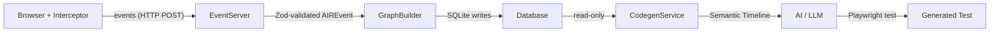
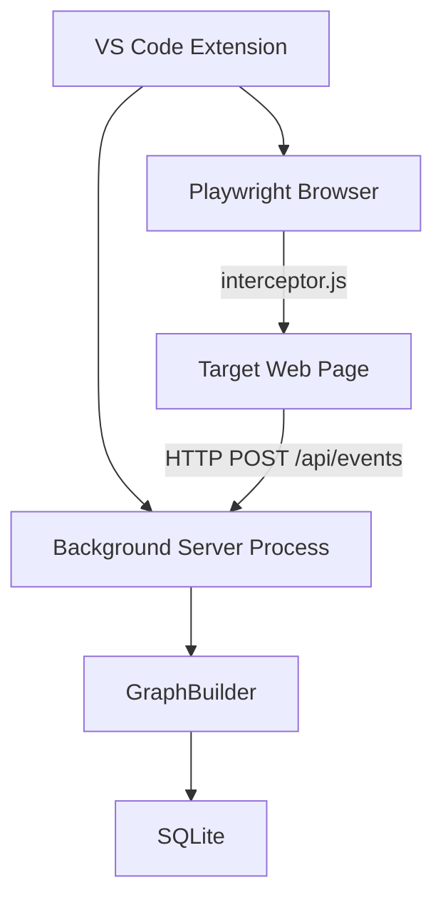
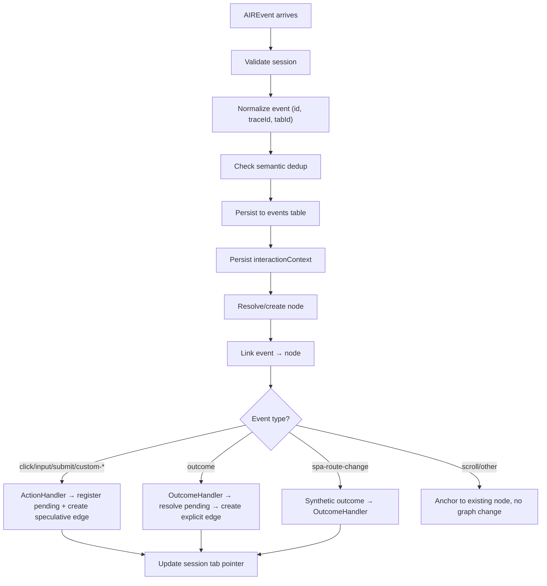

# AIR Codebase — Deep Architectural Walkthrough

## 1. What AIR Does

AIR (**Automated Intelligence Recorder**) is a system that **records user interactions with web applications** (clicks, inputs, submits, navigation, custom controls), builds a **stateful graph** of the user's journey (nodes = page states, edges = transitions), and then uses that graph to **generate Playwright test code** via an AI-powered pipeline.



---

## 2. Workspace Package Layout

| Package | Path | Purpose |
|---------|------|---------|
| **root** | `e:\Air Desktop` | npm workspace root, Vite/electron config (legacy) |
| **core** | `core/` | Types (Zod), Graph engine, DB layer, Logger |
| **shared** | `packages/shared/` | Selectors, Anchor utilities, URL normalization |
| **vscode-extension** | `packages/vscode-extension/` | VS Code extension — **the runtime host** |
| **codegen** | `packages/codegen/` | Codegen service, Selector resolver, Flow review, LLM orchestrator |
| **reporter** | `packages/reporter/` | E2E reporter and AirBasePage |
| **interceptor** | `interceptor/` | Browser-injected JS (136KB monolith) |
| ~~**electron**~~ | `electron/` | ~~Electron shell~~ — **DEPRECATED**, but `EventServer` still lives here |

> [!IMPORTANT]
> `packages/vscode-extension/server-entry.ts` line 20 still imports:
> ```ts
> import { EventServer } from '../../electron/main/event-server';
> ```
> This is the **only remaining hard dependency on `electron/`** from the active codebase. The `EventServer` class itself is framework-agnostic (pure `http.createServer`) and can be moved to `core/` or `packages/shared/`.

---

## 3. Data Pipeline — Layer by Layer

### 3.1 Interceptor (Browser-Side)

[interceptor/interceptor.js](file:///e:/Air%20Desktop/interceptor/interceptor.js) — 136KB JavaScript file injected into every page via Playwright's `addInitScript()`.

**What it does:**
- Listens for DOM events (click, input, submit, scroll, hover)
- Detects custom controls (div-based dropdowns, menus)
- Captures `ElementFingerprint` per element (selector, priority, attributes, context)
- Captures `PageSnapshot` (HTML, anchors, composite anchors, control signature)
- Detects SPA route changes (history API, popstate)
- Fires `interactionContext` snapshots for selector resolution
- Sends events via `__air_gmSend()` / `__air_gmBeacon()` to the local HTTP server

### 3.2 VS Code Extension (Host Process)

[extension.ts](file:///e:/Air%20Desktop/packages/vscode-extension/src/extension.ts) — The runtime host.

**Architecture:**


**Key commands:** `air.startRecording`, `air.stopRecording`, `air.inspectSession`, `air.exportSession`, `air.deleteSession`

**How it works:**
1. `activate()` — Starts background server process via `spawn(process.execPath, [serverModule])`
2. `startRecording()` — Launches Chromium via Playwright, injects config + interceptor
3. Config script sets `window.__AIR_CONFIG__` and transport functions
4. `__air_nodeSend` bridge: falls back to Node-side `fetch()` when browser `fetch()` fails (CSP)
5. `stopRecording()` — Flushes interceptor queue, closes browser, marks session ended

### 3.3 Server Entry (Background Process)

[server-entry.ts](file:///e:/Air%20Desktop/packages/vscode-extension/server-entry.ts) — Spawned as a child process.

**Bootstrap sequence:**
1. Opens SQLite database (`DatabaseService.create()`)
2. Runs migrations (`runMigrations()`)
3. Instantiates all 7 repositories
4. Creates `GraphBuilder` with all dependencies
5. Creates `EventServer` with extension-specific route handler
6. Starts cleanup service (stale pending actions, old logs, dedup TTL)
7. Prints `AIR_SERVER_PORT:{port}` to stdout for the extension to pick up

**Extension routes:** `/api/sessions`, `/api/sessions/:id/inspect`, `/api/sessions/:id/end`, `/api/sessions/:id/export`, `/api/debug/events`, `/api/debug/logs`

### 3.4 EventServer (HTTP → Graph Pipeline)

[event-server.ts](file:///e:/Air%20Desktop/electron/main/event-server.ts) — **Still in `electron/`, needs to move.**

**Request flow:**
1. Receive JSON body (single event or `{ events: [...] }` batch)
2. Normalize snapshot fields (coerce string → `{ html: string }`)
3. Validate via `AIREventSchema.safeParse()` (Zod discriminated union)
4. Check session ID matches active recording
5. Call `graphBuilder.processEvent(event)`
6. Return success/failure with stage info

---

## 4. Core Type System

All types are **Zod schemas** in [core/types/](file:///e:/Air%20Desktop/core/types/index.ts):

### 4.1 Event Types (Discriminated Union)

| Event Type | Schema | Key Fields |
|-----------|--------|------------|
| `click` | `ClickEventSchema` | fingerprint, pageSnapshot, seek |
| `input` | `InputEventSchema` | fingerprint, trigger, inputValueMasked, selectedLabel |
| `submit` | `SubmitEventSchema` | fingerprint, meta.formId |
| `scroll` | `ScrollEventSchema` | scroll.x/y/deltaY |
| `outcome` | `OutcomeEventSchema` | meta.settleType, meta.urlAfter, interactionContext |
| `custom-control-open` | `CustomControlOpenEventSchema` | controlFamily, triggerFingerprint |
| `custom-select` | `CustomSelectEventSchema` | selection.label/value/index |
| `custom-menu-select` | `CustomMenuSelectEventSchema` | selection, optionRole |
| `spa-route-change` | `SpaRouteChangeEventSchema` | navigation.from/to, changeType |
| `hover` | `HoverEventSchema` | meta.domChanged |
| `network` | `NetworkEventSchema` | network.method/url/status |
| `custom` | `CustomEventSchema` | payload (generic) |

**Base fields (all events):** `id`, `timestamp`, `traceId`, `sessionId` (format: `session-{uuid}`), `tabId`, `pageUrl`, `normalizedUrl`, `nestedContext`, `schemaVersion`

### 4.2 Graph Types

| Type | Fields |
|------|--------|
| `GraphNode` | id, canonicalHash, pageUrl, normalizedUrl, snapshotHtml, anchors, contextTokens, controlSignature, stateSource |
| `GraphEdge` | id, fromNodeId, toNodeId, triggerEventId, fingerprintHash, outcomeType, sampleSize |
| `Outcome` | id, edgeId, targetNodeId, probability, decayedCount |
| `PendingAction` | traceId, sessionId, tabId, fromNodeId, triggerEventId, status |
| `Session` | id, projectId, startedAt, lastEventAt, lastNodeId, eventCount, status |

### 4.3 Key Supporting Types

- **`ElementFingerprint`** — 4-layer identification: selector, priority, textExcerpt, context (parent/container), attributes, attributesHash
- **`PageSnapshot`** — html, anchors (flat string array), compositeAnchors, controlSignature, viewport, isStable
- **`SeekStrategy`** — how user located element (scroll/search/filter/direct)
- **`OutcomeType`** — `navigation`, `state_refresh`, `no_change`, `immediate_action`

---

## 5. Graph Engine — The Brain

### 5.1 GraphBuilder ([graph-builder.ts](file:///e:/Air%20Desktop/core/graph/graph-builder.ts))

The **1045-line orchestrator**. Every event goes through `processEvent()`:



**Key decisions made in `processEvent()`:**
- **Event-local snapshot fallback** — When input/submit/custom events arrive with no current node, promotes snapshot from the event itself
- **Stale pointer detection** — Events with timestamps older than the session pointer by >5s are treated as out-of-order
- **SPA duplicate suppression** — SPA route changes within 5s of an existing outcome are suppressed
- **Semantic dedup** — SHA-256 key built from session+tab+trace+type+url+selector to detect duplicate events

### 5.2 BaselineHandler ([baseline.handler.ts](file:///e:/Air%20Desktop/core/graph/handlers/baseline.handler.ts))

Node resolution priority:
1. **Control signature + normalized URL** — Exact match (most stable)
2. **Canonical hash** — SHA-256 of sorted anchors (Strategy A) or cleaned HTML (Strategy B)
3. **Fallback** — Serialized fingerprint HTML

### 5.3 ActionHandler ([action.handler.ts](file:///e:/Air%20Desktop/core/graph/handlers/action.handler.ts))

- Registers `PendingAction` for click/submit/custom-* events (keyed by traceId+session+tab)
- Creates speculative "immediate_action" edges (self-loop fix)
- Fingerprint hash: SHA-256 of `selector|textExcerpt|attributesHash|eventType`

### 5.4 OutcomeHandler ([outcome.handler.ts](file:///e:/Air%20Desktop/core/graph/handlers/outcome.handler.ts))

Resolves pending actions when outcomes arrive:
1. **Exact scope match** — traceId + sessionId + tabId
2. **Cross-tab recovery** — Same trace, any tab (for target="_blank" navigations)
3. **Fallback recovery** — Recent pending within 15s on same tab (cross-context outcomes)
4. **Outcome type classification** — Tier 1: explicit settleType, Tier 2: URL comparison, Tier 3: conservative fallback

### 5.5 StateEngine ([state-engine.ts](file:///e:/Air%20Desktop/core/graph/state-engine.ts))

**Strategy A (Functional):** Sorted anchors → SHA-256 hash  
**Strategy B (Visual):** Body HTML → strip scripts/styles/SVGs/dynamic attrs → normalize whitespace → SHA-256

### 5.6 IntentDetector ([intent-detector.ts](file:///e:/Air%20Desktop/core/graph/intent-detector.ts))

Derives human-readable intents from events: `click_login`, `type_username`, `navigate_to_dashboard`

---

## 6. Database Layer

### 6.1 Tables (10 total)

| Table | Purpose |
|-------|---------|
| `sessions` | Recording sessions |
| `session_tab_state` | Per-tab pointer (lastNodeId, lastEventAt) |
| `nodes` | UI state nodes |
| `events` | Raw events (with `CHECK session_id LIKE 'session-%'`) |
| `edges` | Directed transitions between nodes |
| `outcomes` | Probabilistic edge outcomes (Laplace smoothing) |
| `pending_actions` | Unresolved action→outcome pairs |
| `interaction_contexts` | Full-page snapshots for selector resolution |
| `debug_logs` | Structured diagnostic logs |
| `event_dedup_keys` | Semantic dedup shadow index |

### 6.2 Key Indexes

- `idx_edges_dedup` — UNIQUE on `(from_node_id, to_node_id, fingerprint_hash)`
- `idx_outcomes_edge_target` — UNIQUE on `(edge_id, target_node_id)`
- `idx_nodes_project_hash` — UNIQUE on `(project_id, canonical_hash)`

### 6.3 Migration System

[migrations.ts](file:///e:/Air%20Desktop/core/db/migrations.ts) — Named migrations tracked in `schema_version` table. Includes idempotency checks (column existence, NOT NULL enforcement).

---

## 7. Shared Package (`@air/shared`)

### 7.1 Selectors ([selectors.ts](file:///e:/Air%20Desktop/packages/shared/src/selectors.ts))

`generateOptimalSelector()` — Priority cascade:
1. `data-testid` (rank 1)
2. `id` (rank 2, skips dynamic IDs)
3. `name` / `aria-label` / `role` / `type` (rank 3)
4. Stable CSS class (rank 7)
5. Text content (rank 8)
6. Parent-relative path (rank 10)
7. Full XPath (rank 10)

### 7.2 Anchors ([anchor-utils.ts](file:///e:/Air%20Desktop/packages/shared/src/anchor-utils.ts))

Two anchor systems:
- **Flat anchors** (`scanPageAnchors`) — `["URL:/path", "BUTTON:text=Login", "INPUT:name=username"]`
- **Composite anchors** (`scanCompositeAnchors`) — Structural: `form_cluster`, `table_row`, `dialog_actions`, `menu_group`, `container_controls`

### 7.3 URL Utils ([url-utils.ts](file:///e:/Air%20Desktop/packages/shared/src/url-utils.ts))

`normalizeUrl()` — Strips trailing slash, keeps origin + pathname (no query/hash).

---

## 8. Codegen Service (`packages/codegen`)

[codegen.service.ts](file:///e:/Air%20Desktop/packages/codegen/src/codegen.service.ts) — **1670 lines, "The Compressor"**.

**Input:** Raw SQLite data (events, edges, nodes, outcomes)  
**Output:** `CodegenSession` — a compressed "Semantic Timeline" (<8KB per session)

**What gets stripped:** Raw HTML, network events, scroll/hover noise, input heartbeats  
**What gets preserved:** Selectors, intents, outcome types, confidence, anchor assertions, page URLs

**Post-processing filters:**
- **Fix A** — Intent from `textExcerpt` (not selector)
- **Fix B** — `suppressPreNavSetupClicks()` — Removes fragile-selector immediate_action clicks before navigation
- **Fix C** — `deduplicateSharedAssertions()` — Strips anchor assertions shared across 2+ destination pages
- **Click→Input collapse** — `collapseRedundantClickBeforeInput()`

**Also in codegen:**
- `selector-resolver.ts` (110KB) — Full-page selector resolution with snapshot HTML
- `snapshot-selector.ts` (33KB) — Chooses best snapshot for each codegen step
- `llm-orchestrator.ts` (50KB) — LLM prompt construction and test generation
- `flow-review.service.ts` — Flow review and validation

---

## 9. Test Coverage

### Core Tests (`core/__tests__/`) — 12 specs
- Graph builder: atomic dedup, semantic dedup, SPA dedup, stale pointer, dedup cleanup
- Outcome handler: cross-tab recovery, idempotency
- Event schema survival
- Interaction context repository
- Custom control capture
- Active path contract fixture (E2E)

### Codegen Tests (`packages/codegen/__tests__/`) — 12 specs
- `codegen.service.spec.ts` (34KB), `resolver.spec.ts` (122KB)
- LLM orchestrator, smoke KPI, submit-trace unification
- Composite anchor parity, snapshot selector policy

### Shared Tests (`packages/shared/__tests__/`) — 3 specs
- Anchor consistency, selector consistency, OrangeHRM smoke

---

## 10. Key Observations for Stability Work

### 🔴 Critical: `electron/` Dependency
`EventServer` lives in `electron/main/event-server.ts` but is imported by the VS Code extension's `server-entry.ts`. This class has **zero Electron-specific code** — it's pure `http.createServer`. Moving it to `core/` or creating a shared server package would cleanly sever the dependency.

### 🟡 Architecture Observations

1. **`server-entry.ts` duplicates routes** that could be part of `EventServer` — session CRUD, inspect, export, debug endpoints are hand-written HTTP handlers outside the core
2. **Interceptor is a 136KB monolith** — Changes to anchor/selector logic in `shared/` need manual synchronization with `interceptor.js`
3. **Root `package.json` still references electron** — `electron-vite`, `electron-builder` in devDeps, `dev`/`build` scripts use `electron-vite`
4. **`src/` directory** contains a React UI (App.tsx, components, stores) — appears to be the old Electron renderer, may or may not be active
5. **Multiple `.bak` and temp files** at root — `vite.config.ts.bak`, `temp_electron_vite_index.txt`, trace session JSONs

### 🟢 Strengths

1. **Zod schema validation** is thorough — discriminated union with `.passthrough()` for forward compatibility
2. **Transaction safety** — GraphBuilder wraps all writes in `db.transaction()`
3. **Bug fix documentation** is excellent — Bug #3, #9, #10c, #10d all documented in code comments
4. **Tab-scoped session management** — Clean `session_tab_state` table with cross-tab recovery
5. **Semantic dedup** — SHA-256 dedup keys with TTL cleanup prevent double-processing
6. **Test coverage** is substantial — 27+ spec files covering critical paths

---

## 11. Product Vision

### 11.1 The Thesis

> **AIR is a local-first proof layer for AI-assisted test automation.**
>
> It records real user intent, validates executable locators and outcomes,
> generates proof-backed Playwright actions, lets IDE agents format those actions
> into repo-native tests, and uses smoke runs + micro-sessions to repair flows when the app changes.

AIR is **not** just "record browser → generate Playwright script". The full vision is:

```
AIR becomes the test automation memory + proof layer inside the developer's IDE.
```

### 11.2 Target User Flow

```
1.  User installs AIR npm package / core
2.  User installs VS Code extension
3.  User starts a recording session from:
    - CLI command
    - VS Code UI
    - or an IDE LLM like Copilot / Codex / Cursor
4.  User records a real browser flow
5.  AIR stores the flow as graph + evidence + selector proof
6.  User reviews the recorded flow using:
    - air-review command
    - VS Code UI
    - or by asking the IDE LLM: "Show me what AIR recorded"
7.  AIR generates repo-native Playwright tests
8.  IDE LLM formats/wraps AIR truth into the user's codebase style
9.  AIR smoke-runs the generated script
10. If app changes later, user tells the IDE LLM:
    "This flow is broken / checkout button changed / update login flow"
11. IDE LLM calls AIR tools
12. AIR opens a repair/micro-session or uses failure report
13. User shows the changed step if needed
14. AIR updates the recorded flow graph and regenerates/patches the script
```

### 11.3 Core Architecture Principle

```
AIR owns truth.
IDE LLM owns interaction, explanation, and formatting.
```

**AIR decides:**
- Recorded flow truth
- Selectors
- Action sequence
- Proof level
- Smoke result
- Repair candidates

**IDE LLM helps with:**
- Understanding user request
- Calling AIR commands/tools
- Explaining recorded flow
- Formatting code into repo conventions
- Applying patches

### 11.4 Identified Traps

> [!CAUTION]
> **Trap 1: Copilot Codegen Trap**
> Do not let Copilot invent locators. It can wrap AIR-proven locators into POM/Cucumber/framework style, but AIR must provide the executable selector truth.

> [!CAUTION]
> **Trap 2: Chat-to-Update Illusion**
> User saying "checkout button changed" is not enough. The IDE LLM needs fresh browser evidence through AIR: smoke failure report, live DOM, or micro-session where user shows the new step.

### 11.5 Target Metric

```
If a user records a session,
at least 75% of generated scripts should pass smoke without manual edits.
```

### 11.6 Future AIR IDE Tool Contract

The interface that makes "user talks to IDE LLM" real without letting the LLM hallucinate test truth:

```
air.reviewFlow(sessionId)
air.explainFlow(sessionId)
air.generateTest(sessionId)
air.runSmoke(sessionId)
air.explainFailure(reportId)
air.startRepairSession(flowId, stepId)
air.patchFlowStep(flowId, stepId, newEvidence)
air.regenerateTest(flowId)
```

---

## 12. Vision vs. Reality — Codebase Assessment

### ✅ What's Already Built & Working

| Vision Layer | Current Reality | Notes |
|---|---|---|
| Record browser truth | Interceptor → EventServer → GraphBuilder | Full pipeline operational |
| Build graph | Nodes, Edges, Outcomes with tab-scoped pointers | Sophisticated (cross-tab, dedup, stale detection) |
| Validate selectors | `SelectorSpec`, `SelectorEvaluation`, `selector-resolver.ts` (110KB) | Deep investment |
| Generate proof-backed action IR | `CodegenService` ("The Compressor") → Semantic Timeline | Battle-tested (OrangeHRM fixes) |
| Smoke-run generated code | `smoke-runner.spec.ts`, `smoke-kpi.spec.ts` | Exists and runs |
| AIR owns selector truth | `generateOptimalSelector()` with priority cascade | Core principle enforced |
| Truth-preserving codegen | Fix A/B/C, `suppressPreNavSetupClicks`, shared assertion dedup | Prevents LLM hallucination |
| Custom control modeling | `custom-control-open`, `custom-select`, `custom-menu-select` | Three event types with full schema |
| VS Code extension as host | Extension with start/stop/inspect/export/delete | Working replacement for Electron |
| Tab-scoped session tracking | `session_tab_state` table, cross-tab recovery | Clean implementation |

### 🟡 What's Partially Built

| Vision Layer | Current State | Gap |
|---|---|---|
| `air-review` / flow review | `flow-review.service.ts` + formatter + types exist | Not exposed as user-facing command |
| LLM orchestration | `llm-orchestrator.ts` (50KB) exists | Needs IDE tool contract to plug in |
| Repair / micro-session | Concepts exist (stale pointer, event-local fallback) | No `startRepairSession()` or `patchFlowStep()` API |
| Smoke failure → repair loop | Smoke runner exists | Loop isn't closed — no `explainFailure()` → repair pipeline |

### ❌ What Doesn't Exist Yet

| Vision Layer | Notes |
|---|---|
| **AIR IDE tool contract** (`air.reviewFlow`, `air.generateTest`, `air.runSmoke`, etc.) | The 8 functions that make LLM integration real |
| **CLI entry points** (`air-review`, `air record`, `air smoke`) | No standalone CLI package |
| **npm package distribution** (user installs `air` as a package) | Not packaged for distribution |
| **IDE LLM integration** (Copilot/Codex/Cursor calling AIR tools) | Not built |
| **Repo-native formatting** (LLM wraps AIR truth into POM/Cucumber/etc.) | Not built |

---

## 13. Next Steps Roadmap

### Priority 1: Foundation Cleanup (Consistency & Stability)
1. **Sever `electron/` dependency** — Move `EventServer` to `core/`, clean root `package.json`
2. **Clean up legacy artifacts** — Remove `.bak` files, temp files, clarify `src/` status
3. **Audit interceptor ↔ shared sync** — Ensure anchor/selector logic matches

### Priority 2: Surface the AIR Tool Contract
4. **Define formal API surface** — The 8 `air.*` functions as a TypeScript interface
5. **Expose via VS Code commands** — Map tool contract to extension commands
6. **Add CLI entry points** — `air record`, `air review`, `air smoke`, `air generate`

### Priority 3: Close the Loop
7. **Smoke → failure → repair pipeline** — `explainFailure()` + `startRepairSession()`
8. **IDE LLM integration** — VS Code tool definitions for Copilot/Codex
9. **npm packaging** — Distributable `@air/core` + `@air/cli` + VS Code extension
